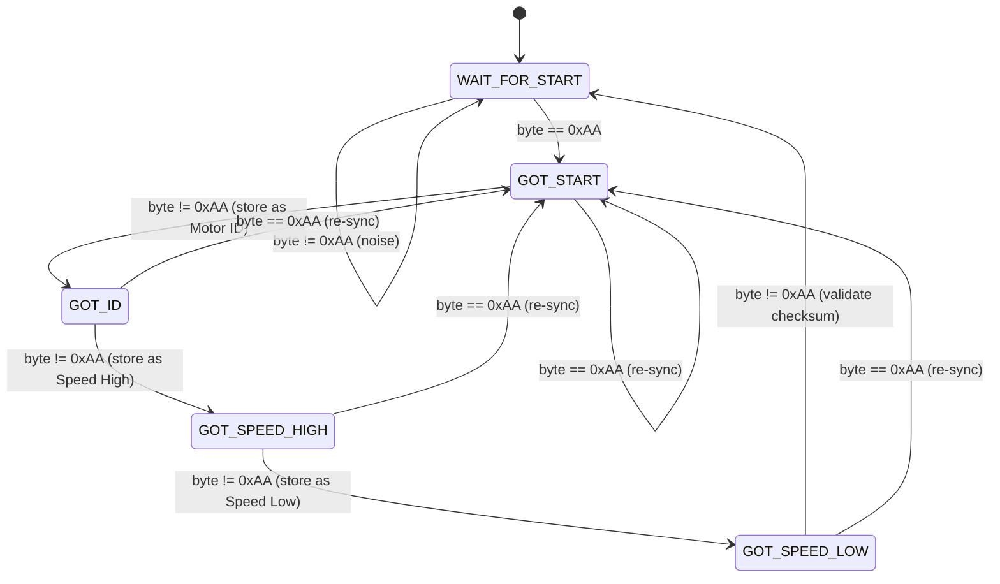

# 📘 Explanation Guide: Robust Byte-by-Byte UART Parser

## Table of Contents

1. [What Is This Program?](#1-what-is-this-program)
2. [Background Concepts](#2-background-concepts)
3. [Packet Structure Deep-Dive](#3-packet-structure-deep-dive)
4. [The State Machine — Heart of the Parser](#4-the-state-machine--heart-of-the-parser)
5. [Checksum: How Error Detection Works](#5-checksum-how-error-detection-works)
6. [Robustness: How the Parser Handles Noise](#6-robustness-how-the-parser-handles-noise)
7. [Key C Language Features Used](#7-key-c-language-features-used)
8. [Real-World Application](#8-real-world-application)
9. [Test Cases Explained](#9-test-cases-explained)
10. [Summary Table](#10-summary-table)

---

## 1. What Is This Program?

This program implements a **UART serial packet parser** — a piece of code that reads raw bytes arriving one-at-a-time from a serial communication line and extracts meaningful motor-control commands from them.

### The Problem It Solves

Imagine you have a robot with multiple motors. A central computer sends speed commands to a motor controller over a **UART serial link** (a simple two-wire TX/RX connection). The data arrives as a continuous stream of bytes, but:

- **There's no clock signal** — bytes arrive asynchronously.
- **The line is noisy** — electromagnetic interference can inject random garbage bytes.
- **Packets can get corrupted** — a bit might flip during transmission.

Your parser must:
- ✅ Find valid packets buried in noise
- ✅ Extract the motor ID and speed
- ✅ Verify data integrity with a checksum
- ❌ Never crash, even on garbage input

---

## 2. Background Concepts

### 2.1 What Is UART?

**UART** (Universal Asynchronous Receiver-Transmitter) is a hardware protocol for serial communication. It's one of the simplest and most common interfaces in electronics:

```
[Microcontroller A] ──TX──────RX── [Microcontroller B]
                     ──RX──────TX──
                     ──GND─────GND──
```

- **Asynchronous**: No shared clock; both sides agree on a baud rate (e.g., 9600 bps, 115200 bps).
- **Serial**: Data is sent one bit at a time (LSB first).
- **Each "frame"**: 1 start bit + 8 data bits + 1 stop bit = 10 bits per byte.

### 2.2 What Is a State Machine?

A **Finite State Machine (FSM)** is a computational model with:
- A finite number of **states** (e.g., IDLE, WAITING_FOR_ID, etc.)
- **Transitions** between states, triggered by **inputs** (incoming bytes)
- **Actions** performed during transitions (store a byte, validate checksum)

> [!TIP]
> State machines are the **gold standard** for parsing serial protocols in embedded systems because they use constant memory (O(1)), process one input at a time, and are naturally robust against unexpected input.

### 2.3 What Is a Checksum?

A **checksum** is a small piece of data derived from the payload, used to detect transmission errors. The sender computes it before transmitting; the receiver recomputes it and compares:

```
Sender:   checksum = f(data)  →  sends [data, checksum]
Receiver: receives [data, checksum]  →  computes f(data)  →  compare
```

If they match → data is (probably) intact. If not → data was corrupted.

---

## 3. Packet Structure Deep-Dive

Each valid packet is exactly **5 bytes**:

| Byte Position | Name | Value | Purpose |
|:---:|:---|:---|:---|
| 0 | `START_BYTE` | Always `0xAA` | Synchronization marker — tells the receiver "a packet begins here" |
| 1 | `MOTOR_ID` | `0x01`–`0xFE` | Identifies which motor to control |
| 2 | `SPEED_HIGH` | `0x00`–`0xFF` | Upper 8 bits of 16-bit speed |
| 3 | `SPEED_LOW` | `0x00`–`0xFF` | Lower 8 bits of 16-bit speed |
| 4 | `CHECKSUM` | Computed | `MOTOR_ID XOR SPEED_HIGH XOR SPEED_LOW` |

### Reconstructing the 16-bit Speed

The speed is too large for a single byte (max 255), so it's split into two bytes:

```
Example: Speed = 1234 (decimal) = 0x04D2 (hex)

SPEED_HIGH = 0x04  (upper byte)
SPEED_LOW  = 0xD2  (lower byte)

Reconstruction:
  (0x04 << 8)    = 0x0400       (shift high byte left by 8 bit positions)
  0x0400 | 0xD2  = 0x04D2      (merge low byte into the empty lower 8 bits)
                 = 1234 decimal  ✓
```

> [!NOTE]
> This is **big-endian** byte order (most-significant byte first). Some protocols use little-endian (least-significant first). Always check the protocol specification!

---

## 4. The State Machine — Heart of the Parser

### 4.1 State Diagram



### 4.2 How Each State Works

#### State 0: `WAIT_FOR_START` (Idle / Hunting)
- **Purpose**: Scan the byte stream for the magic value `0xAA`.
- **Behavior**: Any byte that isn't `0xAA` is **silently discarded** (noise rejection). When `0xAA` is found, transition to `GOT_START`.
- **Analogy**: You're standing in a noisy crowd, listening for someone to say the secret password.

#### State 1: `GOT_START` (Expecting Motor ID)
- **Purpose**: The start byte was detected. The next byte should be the Motor ID.
- **Edge case**: If another `0xAA` arrives, the previous one was probably noise. Stay in `GOT_START` (re-sync).
- **Analogy**: You heard the password, and now you're listening for the speaker's name.

#### State 2: `GOT_ID` (Expecting Speed High Byte)
- **Purpose**: Motor ID is stored. Next byte is the high byte of the speed.
- **Re-sync**: `0xAA` here means corruption → restart.

#### State 3: `GOT_SPEED_HIGH` (Expecting Speed Low Byte)
- **Purpose**: Speed high byte is stored. Next byte is the low byte.
- **Re-sync**: Same `0xAA` check.

#### State 4: `GOT_SPEED_LOW` (Expecting Checksum)
- **Purpose**: All payload bytes are stored. This final byte is the checksum.
- **Action**: Compute `motor_id ^ speed_high ^ speed_low` and compare with the received byte.
  - **Match** → Valid packet! Print/process the command.
  - **Mismatch** → Corrupted! Discard silently.
- **After processing**: ALWAYS reset to `WAIT_FOR_START` regardless of outcome.

### 4.3 Why `switch-case` Instead of `if-else`?

| Feature | `switch-case` | `if-else if` |
|:---|:---|:---|
| Readability | Clean, one case per state | Gets messy with many states |
| Performance | Compiler can use jump tables (O(1)) | Sequential comparison (O(n)) |
| Maintainability | Easy to add/remove states | Error-prone as complexity grows |
| Convention | Industry standard for FSMs | Not preferred for FSMs |

---

## 5. Checksum: How Error Detection Works

### 5.1 XOR Truth Table

| A | B | A ⊕ B |
|:-:|:-:|:-----:|
| 0 | 0 |   0   |
| 0 | 1 |   1   |
| 1 | 0 |   1   |
| 1 | 1 |   0   |

### 5.2 Example Calculation

```
Motor ID:   0x01  =  00000001
Speed High: 0x04  =  00000100
Speed Low:  0xD2  =  11010010

Step 1: 0x01 ^ 0x04
  00000001
  00000100
  --------
  00000101  = 0x05

Step 2: 0x05 ^ 0xD2
  00000101
  11010010
  --------
  11010111  = 0xD7  ← This is the checksum
```

### 5.3 Why XOR?

> [!IMPORTANT]
> XOR checksums are chosen for embedded systems because they are:
> - **Fast**: Single CPU instruction per byte
> - **Tiny**: Zero memory overhead
> - **Effective**: Detects all single-bit errors
> - **Symmetric**: Order of operands doesn't matter

**Limitation**: XOR cannot detect *two* bit-flips in the same position (they cancel out). For higher reliability, protocols use CRC-8/CRC-16, but XOR is perfectly adequate for simple motor-control links.

---

## 6. Robustness: How the Parser Handles Noise

### 6.1 Noise Rejection (Garbage bytes before a packet)

```
Stream: 0x55  0x13  0x7F  0xAA  0x01  0x04  0xD2  0xD7
        ^^^^  ^^^^  ^^^^
        NOISE NOISE NOISE  → silently discarded by WAIT_FOR_START
                           ^^^^^^^^^^^^^^^^^^^^^^^^^^^^^^^^^^^
                           Valid packet → parsed correctly
```

### 6.2 Re-Synchronization (New start byte mid-packet)

```
Stream: 0xAA  0x01  0xAA  0x04  0x00  0x0A  0x0E
        ^^^^  ^^^^
        Start ID=1
                    ^^^^
                    UNEXPECTED 0xAA! → Discard partial packet, re-sync
                          ^^^^^^^^^^^^^^^^^^^^^^^^^^
                          Start of NEW packet → parsed correctly
```

> [!CAUTION]
> The old partial packet `{Motor 0x01, ...}` is **permanently lost**. This is intentional — acting on incomplete data is far more dangerous than skipping a command. The sender can always re-transmit.

### 6.3 Checksum Failure (Corrupted data)

```
Stream: 0xAA  0x02  0x00  0x64  0xFF
                                ^^^^
                                Expected 0x66, got 0xFF → CORRUPT!
                                Discard and reset to WAIT_FOR_START
```

### 6.4 Recovery After Failure

After **any** failure (bad checksum, re-sync), the parser resets cleanly to `WAIT_FOR_START` and correctly parses the very next valid packet. There is no "stuck" state.

---

## 7. Key C Language Features Used

### 7.1 `static` Local Variables

```c
static parser_state_t current_state = STATE_WAIT_FOR_START;
static uint8_t motor_id = 0;
```

- `static` variables inside a function **persist** across function calls.
- Without `static`, the variables would be destroyed and re-created every time `parse_byte()` is called — the parser would have no memory!
- They are initialized **only once** (the first time the function is called).

### 7.2 `typedef enum`

```c
typedef enum {
    STATE_WAIT_FOR_START,
    STATE_GOT_START,
    ...
} parser_state_t;
```

- Creates a named type `parser_state_t` for readability.
- The compiler assigns integer values automatically (0, 1, 2, ...).
- Using an enum instead of `#define STATE_IDLE 0` gives type safety and better debugger output.

### 7.3 Fixed-Width Integers (`uint8_t`, `uint16_t`)

- `uint8_t` = exactly 8 bits, unsigned (0–255) — one UART byte.
- `uint16_t` = exactly 16 bits, unsigned (0–65535) — reconstructed speed.
- These come from `<stdint.h>` and are **essential** in embedded C because the size of `int` varies by platform.

### 7.4 Bitwise Operators

| Operator | Name | Purpose in This Code |
|:---:|:---|:---|
| `^` | XOR | Computing the checksum |
| `<<` | Left Shift | Moving `speed_high` into bits [15:8] |
| `\|` | OR | Merging `speed_high` and `speed_low` into one 16-bit value |
| `(uint16_t)` | Cast | Ensuring the result is treated as a 16-bit value |

---

## 8. Real-World Application

### 8.1 Where This Code Would Run

In a real robot, `parse_byte()` would be called from a **UART interrupt handler**:

```c
// This runs every time a byte arrives on UART1
void USART1_IRQHandler(void) {
    if (USART1->SR & USART_SR_RXNE) {      // Check: data ready?
        uint8_t byte = USART1->DR;           // Read the byte
        parse_byte(byte);                    // Feed to our parser
    }
}
```

### 8.2 What You'd Do With Valid Data

Instead of `printf()`, a real implementation would:

```c
// Option A: Directly set PWM duty cycle
set_motor_pwm(motor_id, speed);

// Option B: Update PID controller setpoint  
pid_set_target(motor_id, speed);

// Option C: Post to an RTOS message queue
motor_cmd_t cmd = {motor_id, speed};
xQueueSend(motorQueue, &cmd, 0);
```

### 8.3 Common Protocols Using Similar Patterns

| Protocol | Start Byte(s) | Checksum | Used In |
|:---|:---|:---|:---|
| This task | `0xAA` | XOR | Motor controllers |
| Dynamixel | `0xFF 0xFF` | Sum & invert | Servos |
| MAVLink v2 | `0xFD` | CRC-16 | Drones |
| NMEA (GPS) | `$` | XOR after `$` | GPS receivers |
| SBUS | `0x0F` | None (fixed timing) | RC receivers |

---

## 9. Test Cases Explained

### Test Summary Table

| # | Test Name | Purpose | Expected Behavior |
|:-:|:---|:---|:---|
| 1 | Valid + leading noise | Noise rejection | Skip `0x55 0x13 0x7F`, parse packet → Motor 0x01, Speed 1234 |
| 2 | Bad checksum | Error detection | Print "INVALID CHECKSUM", discard |
| 3 | Back-to-back valid | State reset | Both packets parsed: Motor 0x03/500, Motor 0x05/2500 |
| 4 | Mid-stream re-sync | Corruption recovery | Discard partial, re-sync, parse Motor 0x04/Speed 10 |
| 5 | Pure noise | Total garbage tolerance | No output — all bytes discarded silently |
| 6 | Recovery after failure | Post-error recovery | Discard bad packet, then succeed with Motor 0x07/Speed 5000 |

### Why These Tests Matter

- **Test 1** proves the parser can **find packets in noise** (essential for a real UART line).
- **Test 2** proves the parser can **detect corruption** and refuse to act on bad data.
- **Test 3** proves the parser **properly resets** between packets.
- **Test 4** is the most critical — it proves the parser can **self-heal** when a packet is interrupted.
- **Test 5** proves the parser **never crashes** on meaningless input.
- **Test 6** proves the parser **recovers fully** after an error — no permanent "stuck" states.

---

## 10. Summary Table

| Aspect | Detail |
|:---|:---|
| **Language** | C (C99 standard) |
| **Function Signature** | `void parse_byte(uint8_t incoming_byte)` |
| **Packet Size** | 5 bytes (1 start + 3 payload + 1 checksum) |
| **Checksum Type** | XOR of payload bytes |
| **Parser Type** | Finite State Machine (5 states) |
| **Memory Usage** | 4 bytes of static storage (O(1)) |
| **Banned Items** | ~~strtok()~~ ~~sscanf()~~ ~~regex~~ ~~string buffers~~ |
| **Error Handling** | Silent discard + automatic re-sync |
| **Crash Safety** | Guaranteed — all inputs handled without UB |

---

> [!TIP]
> **To compile and run:**
> ```bash
> gcc -Wall -Wextra -o uart_parser uart_parser.c
> ./uart_parser
> ```

---

*Guide created for Task 2: Robust Byte-by-Byte UART Parser*
